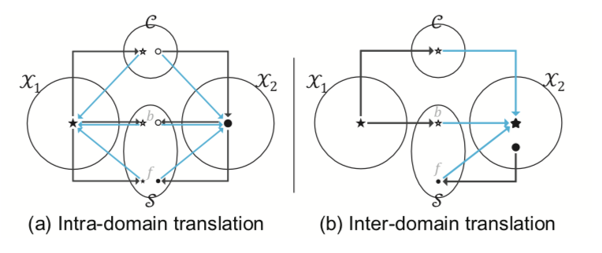

Image-to-Image translation 코딩의 결과 이미지를 보거나 관련 논문의 이미지를 보면 종종 원하지 않는 스타일이 생성 이미지에 들어가는 경우가 많다. 컴퓨터가 보는 이미지는 사람이 보는 이미지와 다르다. 그러므로 바꾸고자 하는 부분이나 목적하는 스타일을 명확하게 컴퓨터에게 알려줘야한다. 그런 고민을 푼 하나의 시도가 해당 [논문](https://arxiv.org/abs/1906.03598v1)이다. 저자는 이전 이미지 변환 과정의 한계점을 (직관적으로)사람이 생각하는 것 처럼 ‘무엇’을 ’어디에’ 적용 할까?라는 고민과 연결시켰다는 점에서 흥미롭게 읽었고 다양한 실험적 결과로 타당성을 탄탄히 했다.

## 1. Introduction 

### 배경 

GAN을 활용한 분야 중 하나로 Image-to-Image translation의 지속적인 연구가 진행되고있다. 최근 [MUNIT](https://arxiv.org/abs/1804.04732)은 source와 target image를 각각 content와 style domain으로 encoding 시킨 후(이를 disentangle이라고 부르기도 함) 이를 AdaIN을 이용해 target image의 스타일을 입히는 Domain translation을 수행했다. 

### 문제 및 그의 중요성 

흑발의 머리색을 금발의 머리색으로 바꾸는 task가 있다고 가정해보자. 선행 연구를 이용하면 머리 색을 바꿀 수 있지만 바뀌기 원치 않는 스타일(얼굴 색, 화장, 성별 등)도 함께 바뀐다. 본 논문에서는 위의 상황을 두 가지 문제로 구체화하고 있다. (1) exemplar(=target) 이미지의 '어떤' style을 입힐지 구체화 할 수 없다. (2) input 이미지의 '어디에' style을 입힐지 구체화 할 수 없다. 위 두 문제를 잘 푼다면 스타일을 입히는 과정을 좀 더 구체적이며 사용자 친화적으로 바꿀 수 있을 것이다. 

### 논문의 목표 

Exemplar 이미지에서 원하는 스타일을 잘 뽑아내며 동시에 input 이미지에서 원하는 부분에 스타일을 잘 입혀보자. 그 방법으로는 mask-guided 방법을 이용했고 과정에서 새로운 네트워크 구조(LOMIT)을 제안했다. 

## 2. Hypothesis 
{: width="150" height="100"}{: .center}

Unpaired인 두 이미지 set은 **content**와 **style**로 구성되며 서로 해당 space를 공유한다. 

content($$\c_1$$)는 얼굴 포즈, 눈, 코, 입의 위치, 머리카락의 모양 등 이미지의 구조와 관련된 부분이다. 그리고 style(s)는 이미지 구조의 표현 방법이다. 쉽게말해 배경 색, 피부 톤, 머리 색, 표정 등과 같이 색칠 정보라고 생각하면 된다. 
또한 style space는 **foreground** style과 **background** style로 이루어진다. foreground style(sf)이란 style을 이동시킬 대상이 되는 style이다. Input 이미지들의 머리카락 색과 exemplar 이미지들의 머리카락 색을 예로 들 수 있다. background style(sb)은 전체 style에서 foreground 를 제외한 나머지 style이다. 
논문에서는 다음과 같은 수식으로 설명한다. 
- 입력 이미지 x = c ⊕ s 
- 스타일 s = sf ⊕ sb
결론적으로 input images에서 뽑아낸 content와 background style을 이용해서 그리고 exemplar images에서 뽑아낸 foreground style을 이용해 원하는 목적 이미지를 생성할 수 있다. 