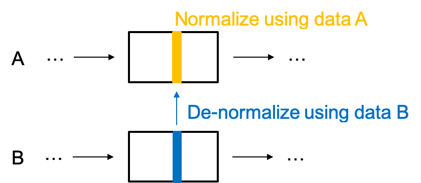
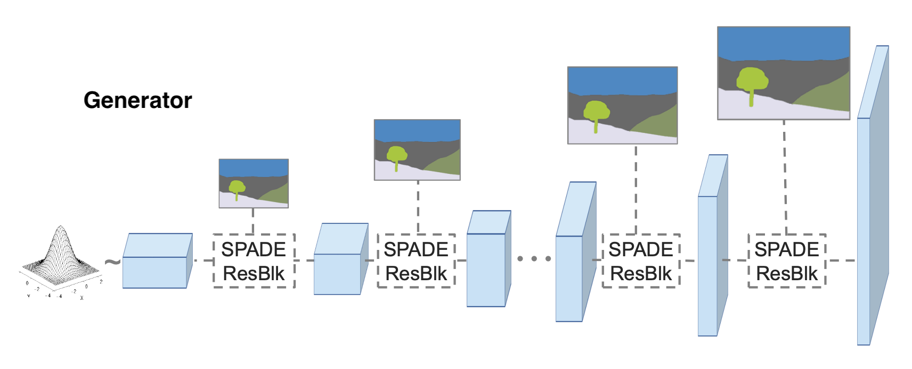
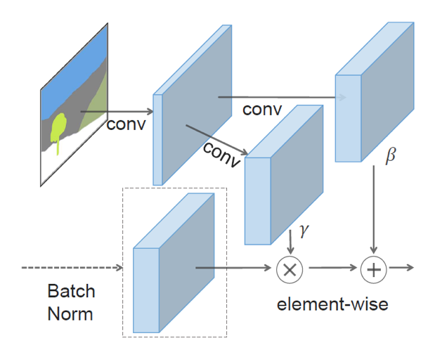
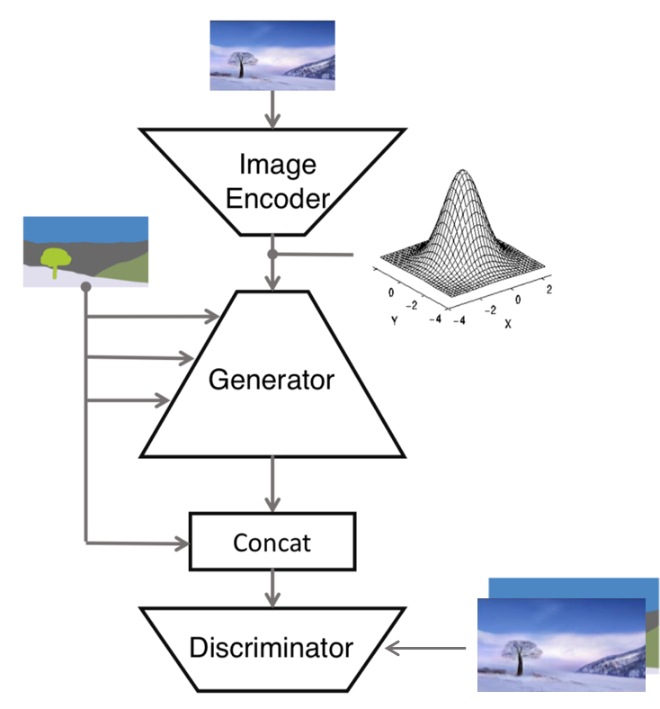
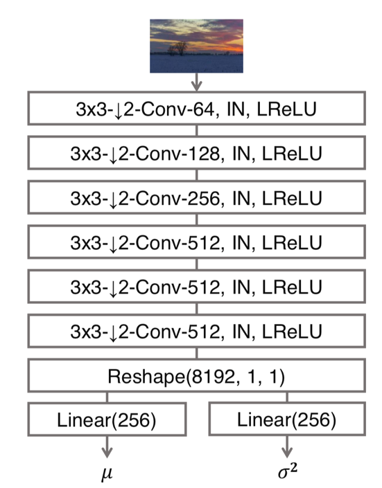
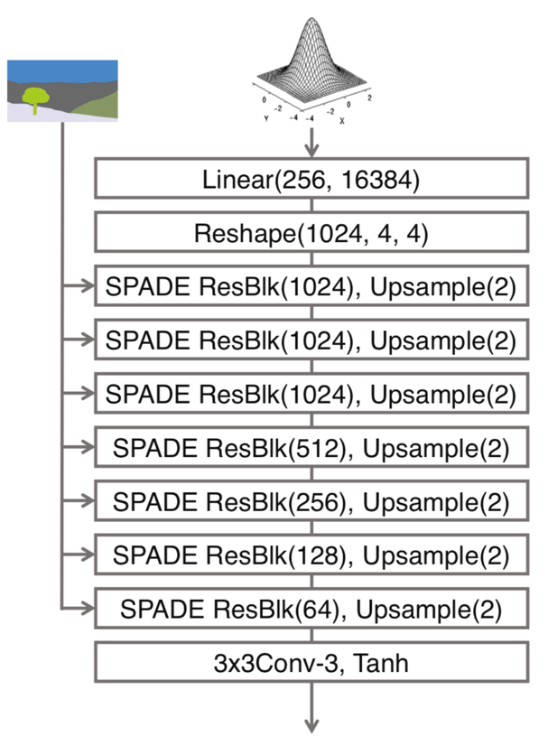
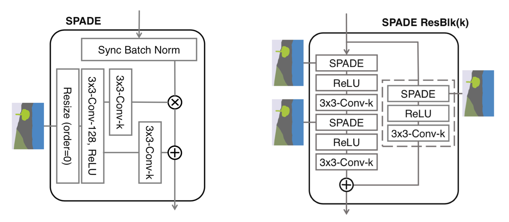
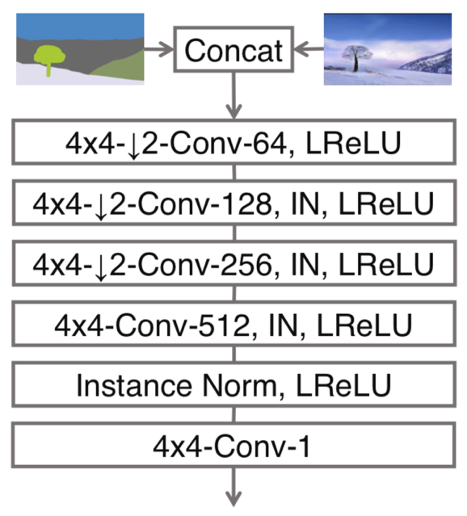
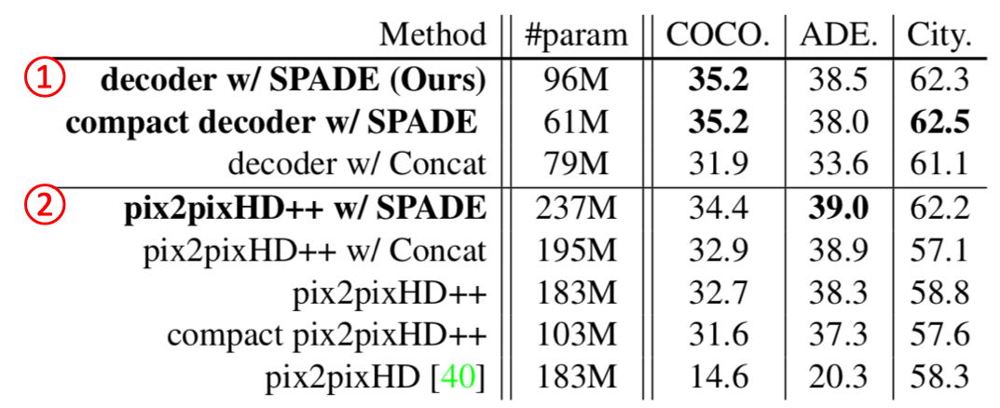
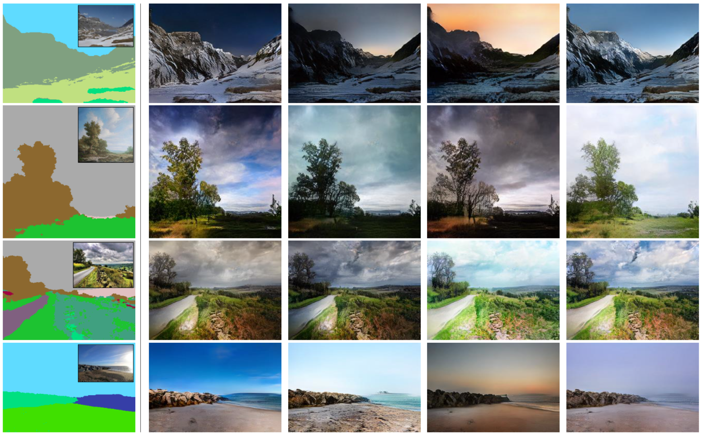

버클리 대학과 NVIDIA에서 올해 3월 18일 아카이브에 새로운 normalization 기법(SPADE)을 적용한 GAUGAN(가우간이라고 읽히는데 '고갱'이라고 읽는다고 한다..ㅎ)이라는 약칭의 [논문](https://arxiv.org/abs/1903.07291)을 올렸다. 올해 초 SNS를 통해 이 [영상](https://www.youtube.com/watch?v=MXWm6w4E5q0)을 먼저 접했고 너무 뛰어난 결과로 논문을 읽게 되었다. 논문의 1저자는 한국인이고 이분은 CycleGAN 논문에도 참여한 분이다. 이번 포스트는 인공지능연구원(AIRI) 논문 세미나 시간에 발표한 내용을 바탕으로 추가적인 정리 및 보강을 기록하기 위해 작성되었고 세미나 시간에 발표한 자료는 [이곳](https://lookaside.fbsbx.com/file/20190612%28SPADEGAN%29_new.pdf?token=AWyZ4bNjK0nWWWFyFjBwPBFy7KU35fZoiQyP6aa3ddRLVLMCmCBKzS7PsW0E1WStyf57yOYTACLBk-nU5IUUXq5yPr7rO4tGw9QDIsenQi8wzGDCOLX4DazMdg8-kUMPVKxcAZn_8GsUdN4DOfMreZ6DOac0TG_08FCkUoIQ4oVMEg)에서 확인할 수 있다.

## 1. Introduction 

### 배경 

기준 이미지를 바탕으로 다른 이미지의 내용을 바꾸는 conditional image synthesis 분야는 전통적인 방법과 최근 딥러닝 방법으로 많이 연구되고 있다. 이 논문은 semantic(= label된 mask = segmentation) 이미지를 photorealistic 이미지로 바꾸는 task에 집중하였다. 

### 문제 및 그의 중요성 

Image to image translation 과정에서 흔히 사용되는 convolutional process는 conv → normalize → activation 이다. 이때 normalize layer는 입력 이미지의 정보를 **유실**시킨다. 

> Normalization layer tend to "wash away" information in input image 

### 논문의 목표 

Semantic 이미지를 photorealistic 이미지로 변환하는 과정에서 입력 이미지의 정보를 잘 유지하는 새로운 형태의 normalize 방법(SPADE)를 제안

## 2. Conditional Normalization Layers

Hidden layer 결과 feature map의 bais를 줄여 학습의 안정성을 높이는 일반적인 normalization 기법을 unconditional normalization layer라고 한다. 대표적으로 batch norm, weight norm, instance norm, group norm 등이 있고 이들에 대해 잘 정리된 [블로그](http://mlexplained.com/2018/11/30/an-overview-of-normalization-methods-in-deep-learning/)가 있어 참고하면 좋을 듯 하다. 

{: width="600" height="180"}{: .center-image}

이러한 unconditional normalization layer는 외부 데이터에 상관없이 단순히 하나의 데이터 도메인에서 적용된다. 즉, 외부 데이터에 의존적이지 않다. 하지만 <u>conditional normalizatin layer는 하나의 데이터 도메인의 특성을 다른 데이터 도메인에 입히는 것을 목적</u>으로 하며 그렇기에 외부 데이터에 의존적이다. 

{: width="400" height="180"}{: .center-image}

위 그림은 목적을 간략히 도식화한 것으로 먼저 A의 특성을 A 도메인으로부터 제외(normalize) 시키고 그 후 B 도메인의 특성(평균과 분산)을 A 도메인에 입힌다(de-normalize). Image synthesis 과정에서 주로 쓰이며 [conditional_batch_norm](https://arxiv.org/abs/1610.07629)과 [AdaIN](https://arxiv.org/abs/1703.06868)이 대표적인 예이다. 

## 3. Basic Idea 
 
일반적인 conditional normalization layer 과정은 외부 데이터의 평균과 분산 값(scalar)만을 이용한다. 이미지를 두 개의 값으로 표현하는 것은 불충분하고 이 과정에서 정보의 유실이 있다. 또한 복잡한 스타일을 입히는 데는 충분하지 않다. 

{: width="500" height="180"}{: .center-image}

Latent value(z)를 이미지로 만드는 전체 과정 중 segmentation 이미지는 가이드 역할을 하도록 한다. 이때 segmentation 이미지의 정보를 (정보를 담는 데 한계가 있는) scalar의 형태가 아니라 tensor의 형태로 각 위치마다 de-normalize(affine transform)를 적용해보자!

## 4. SPatially-Adaptive DEnormalization(SPADE)

{: width="450" height="270"}{: .center-image}

- 정의 : Conditional 이미지로 제공되는 mask 이미지를 두 개의 feature map tensor($\gamma$, $\beta$)로 embedding 시킨다. 이들은 각각 해당 위치의 평균과 분산을 의미하며 main 이미지 처리 과정에 element-wise affine transform 연산이 수행된다. 

- 의의 : $\gamma$와 $\beta$는 입력으로 제공되는 mask의 특정 부위에 해당해서 그 공간의 의미 있는 정보를 담고 있다. 그렇기에 정보 유실이 적다(정보를 잘 유지한다). 최종적으로 <u>segmentation 이미지의 특정 영역의 pixel에서 결과물 해당 영역 pixel로의 mapping function을 구하는 과정</u>이라고 생각할 수 있다. 

>  It can better preserve semantic information against common normalization layers.

- SPADE는 다른 conditional normalization layer의 일반적인 형태라고 한다. 논문에 특정 조건 아래서 conditional batch norm 그리고 AdaIN과 같다고 한다.

## 5. Network Architecture
{: width="300" height="300"}{: .center-image}

* 목적 : Semantic 이미지를 photorealistic 이미지로 변환 
* 입력 : 원본 이미지와 이 이미지의 segmentation 이미지 
* 출력 : photorealistic 이미지 
* 구성 network 
    1. Image Encoder
    2. Generator 
    3. Discriminator 
* 특징 : SPADE는 Generator 네트워크에서만 사용 

### 5-1. Image Encoder 

{: width="300" height="300"}{: .center-image}

* 목적 : 실제 원본 이미지를 인코딩 
* 입력 : 실제 원본 이미지 
* 출력 : encoding된 256 차원 vector 2개 

* 구체적 특징 
    출력된 2개의 256차원 vector는 reparameterization trick을 이용해 256차원 vector를 sampling 한다. 그 결과의 의미는 출력 이미지의 스타일 code로 생각하면 된다. 이는 이후에 multi modal synthesis에 활용될 수 있다. 

#### Reparameterization trick 

VAE의 학습에 사용되는 방법으로 latent space가 정규분포를 따르도록 만드는 과정의 일부이다. 실제로 image encoder의 출력물은 vector 2개인데, 각각을 평균과 분산이라고 가정하고 그 분포에서 1개의 값을 sampling 한다. 결과적으로 이 과정을 거치면 256차원의 vector 1개가 생성된다. 

### 5-2. Generator 

{: width="300" height="300"}{: .center-image}

* 목적 : 특정 분포를 따르는 임의의 vector로부터 mask 이미지를 스타일링 하는 과정 

* 입력 : 
    - (sampling 한) 256차원 vector
    - mask 이미지 

* 출력 : 스타일이 입혀진 mask 이미지(원본 이미지와 같아야 함)

* 구성 network 
    - SPADE ResBlk
    - Upsample : 매 단계마다 feature map의 resolution을 맞춰주기 위해 

#### SPADE 와 SPADE ResBlk

{: width="600" height="300"}{: .center-image}

* 역할 : 4에서 언급한 SPADE와 그를 residual block 화 한 모듈이다. 실제로 semantic 이미지에 색상을 입히는 과정으로 여러 resolution을 거쳐 <u>각 spatial region에 어떤 스타일이 입혀져야 되는지는 알려주는 mapping function을 구하는 부분</u>이다. 

### 5-3. Discriminator 
{: width="300" height="300"}{: .center-image}

* 목적 : 입력이 '실제 이미지와 mask 이미지'인지 '생성 이미지와 mask 이미지' 인지를 구분 

* 입력 : concat(이미지, 실제 이미지의 mask 이미지)

* 출력 : True / False logit 
    
## 6. Loss Functions 

이 논문의 objective function은 [pix2pixHD](https://arxiv.org/abs/1711.11585)에서 사용한 그것을 많이 차용했다. 이것들과 새로이 사용된 function을 추가적으로 설명한다.

### 6-0. Same loss in pix2pixHD 

pix2pixHD에서 multi-scale(총 3개) discriminator를 사용했고 이에 따라 제안한 새로운 GAN loss를 사용했다. 두 파트로 이루어져 있고 그중 하나는 다음과 같다. 

$$
\min_G \max_{D1, D2, D3} \sum\limits_{k=1,2,3} L_{GAN}(G, D_k) 
$$

$$
= \min_G \max_{D1, D2, D3} \sum\limits_{k=1,2,3} [ E_{(s,x)∼p_{data}(s,x)}[logD_k(s,x)]+E_{s∼p_{data}(s)}[log(1-D_k(s,G(s)))]]
$$

$D_k$는 각각 $D_1, D_2, D_3$을 나타내고 s는 segmentation 이미지, x는 segmentation 이미지의 원본 이미지이다. 기본적인 GAN loss의 형태와 크게 다르지않다. 다음 loss는 아래와 같다 

$$
L_{FM}(G,D_k)=E_{(s,x)∼p_{data}(s,x)} \sum\limits_{i=1}^T
\frac 1 N_{i} [││D_k^{(i)}(s,x) - D_k^{(i)}(s, G(s))││_1]
$$

FM는 feature matching의 약자로 각 $D_k$의 input인 중간 feature map 사이의 $L_1$ loss이다. 

pix2pixHD에서 사용한 전체적인 loss는 위 두 loss의 총 합이다. 

$$
\min_G((\max_{D_1, D_2, D_3} \sum\limits_{k=1,2,3}L_{GAN}(G,D_k)) + \lambda \sum\limits_{k=1,2,3} L_{FM}(G,D_k))
$$

$\lambda$는 두 loss의 비중을 조정하는 상수로 10으로 설정했다고 한다. pix2pixHD 논문은 아직 깊이있게 보질 못했다. 그래서 논문의 loss 부분과 [학회 발표 slide](https://drive.google.com/file/d/1pObGZvEgPILtRsqEP07sv8CtNuQ55xur/view)를 참고하였다. 

### 6-1. KL Divergence Loss in Image encoder 

우리가 원하는 것은 image encoder를 거쳐 나온 $\mu$와 $\sigma$가 각각 0과 1이 되는 것이다. 즉 이 두 값으로 reparameterization trick을 통해 sampling 한다면 normal 분포에서 sampling 한 것과 같은 효과가 있길 바르는 것이다. 이를 강제하기 위해 사용된 loss이다. pix2pixHD에서는 사용하지 않은 개념이다. 

$$
L_{KLD}=D_{KL}(q(z│x)││p(z)) 
$$

encoder의 결과는 $q(z│x)$이고 이는 $q(z│x)∼N(\mu,\sigma^2I)$를 만족하고 우리가 원하는 prior인 $p(z)$는 $p(z)∼N(0, I)$를 만족한다. 이렇게 prior가 간단한 normal 분포라면 위의 $L_{KLD}$는 다음의 식으로 간단화 될 수 있다. 

$$
\frac 1 2 \sum (\mu^2 + \sigma^2 - ln(\sigma^2) - 1)
$$

이 loss는 VAE에서 사용된것으로 [여기](https://arxiv.org/abs/1312.6114)에서 제안되었다. 하지만 논문의 난이도가 높아서...ㅠ NAVER D2 이활석님의 "[오토인코더의 모든 것](https://d2.naver.com/news/0956269)" 강의 영상을 많이 참조했다. 

### 6-2. Hinge Loss in Discriminator

pix2pixHD에서는 least squared loss를 사용했지만 여러 실험적 결과로 이를 hinge loss로 대체했다고 한다. 이 loss는 각 데이터를 구분하면서 데이터와 가장 먼 결정 경계를 찾는데 사용하는 손실 함수로 SVM에서 사용하는 손실 함수다. 이를 GAN에서 사용한 경우에 아래와 같은 형태가 된다. 아래 식은 [spectral normalization](https://arxiv.org/abs/1802.05957)에서 차용한 것이다.

$$
L_{hinge}=E_{x∼q_{data}(x)}[min(0, -1+D(x))] + E_{z∼p(z)}[min(0, -1-D(G(z)))]
$$

참고로 spectral norm을 제안한 논문에서는 hinge loss를 사용하면 (inception score와 FID에서) 성능이 잘 나온다고 한다. 각 pixel의 값에 어울리는 색을 선택하는 것을 classification task라고 생각한다면 가장 적절한 class를 선택해야 할 것이고 그 관점에서 hinge loss가 좋은 성능을 보일 수 있다고 생각된다. 

## 7. Experiments 

총 3개 주제의 실험을 진행했다. 각각 (1) 다른 비교 모델과 질적/양적 비교 (2) SPADE의 효과 (3) multi-modal synthesis 이다. 

### 7-1. Comparison SPADE with other baselines 

#### Dataset 

COCO-stuff / ADE20k / ADE20k-outdoor / Cityscapes / Flicker Landscape 으로 총 5가지 Dataset을 사용했다. 

#### Metrics

Segmentation Accuracy 

'잘' 생성된 이미지의 segmentation은 원래 이미지의 segmentation과 큰 차이가 없을 것이라는 컨셉으로 측정하는 metric이다. 두 segmentation 이미지의 pixel-wise mean intersection of union(mIoU)와 pixel-wise accuracy(accu)로 측정한다. 둘 다 클수록 좋은 성능이다. 

Frechet Inception Distance(FID)

생성된 이미지의 분포와 실제 이미지 분포 사이의 거리, distance metric이므로 값이 작으면 좋은 성능을 보인다. 

#### Baseline model 

[pix2pixHD](https://arxiv.org/abs/1711.11585)

앞서 구조와 손실 함수 파트에서 언급한 네트워크로 당시 semantic layout synthesis 분야에서 SOTA인 모델이었다. 

[Cascaded Refinement Network(CRN)](https://arxiv.org/abs/1707.09405)

낮은 resolution부터 높은 resolution까지 점진적으로 키워가면서(cascaded) 학습하는 구조이다. 

[Semi-parametric IMage Synthesis model(SIMS)](https://arxiv.org/abs/1804.10992)

외부 데이터 셋에서 해당 레이블의 일반적인 모습을 학습하고 이를 이용해서 segmentation map을 채워가는 구조를 갖음.

#### Quantitative comparison 

{: width="600" height="100"}{: .center-image}

대부분의 경우 SPADE가 좋은 성능(bold)를 보인다. SIMS는 외부 데이터가 필요하다 그로 인해 장점과 단점(?)이 존재한다. 장점으로는 외부 데이터에 다양하고 양질의 도시 풍경 이미지를 갖고 있어 매우 그럴듯한 이미지를 더 잘 만들어 낼 수 있다. 따라서 더 좋은 FID score를 보인다. 하지만 단점으로는 외부 데이터가 존재하지 않는 COCO-stuff와 ADE20k에는 적용할 수 없다. 따라서 N/A로 표시해 두었다. 

#### Qualitative comparison 

{: width="400" height="110"}{: .center-image}

Amazon Mechanical Turk를 이용했다. 사용자는 segmentation 이미지와 이를 이용해 생성한 이미지 두 개를 받는다. 각각 SPADE를 이용한 결과물과 baseline model을 이용해 만든 이미지이다. "해당 segmentation 이미지와 더 잘 부합 (corresponding)하는 이미지를 고른다. 각 데이터 셋마다 500번의 질의가 있었고 모든 경우 baseline 모델보다 좋은 평가를 받았다. 수치는 SPADE 이미지가 더 좋다고 말한 비율이다. 

### 7-2. Effectiveness of SPADE

{: width="400" height="150"}{: .center-image}

- compact : Depth를 줄인 모델 

- pix2pixHD++ : pix2pixHD를 개선한 모델. 구체적으로 어떻게 개선했는지는 언급되지 않음. #param은 같기(183M)에 loss 혹은 annealing 등을 추가하지 않았을지 싶음. SPADE는 붙이지 않았다고 한다. 

- 성능 수치는 mIoU score를 사용했다. 

① : SPADE가 concat보다 높은 score를 갖고 있다. 그뿐만 아니라 compact SPADE의 경우 ②의 다른 모델들보다 좋은 성능을 보이고 있다. 

② : SPADE 사용에 따른 성능 향상을 보여주고 있다. Concat과도 비교와 SPADE 사용 여부에 따른 성능 비교를 보여준다. 

mIoU score가 좋다는 것은 그만큼 segmentation의 의미를 잘 유지한다고 볼 수 있다. 이 테이블에서 집중할 부분이 조금 있다고 본다. 먼저 concat이나 SPADE를 안 쓴 경우보다 쓴 경우에 성능이 많이 향상됨을 볼 수 있다. 하지만 <u>오직 SPADE만을 썼다고 score가 많이 높아지는 것은 아니다</u>. 심지어 ADE dataset의 경우 pix2pixHD++ concat의 score(38.9)가 ①의 모델들보다 성능이 좋다. 그리고 최고 좋은 성능(39.0)과 그렇게 큰 차이가 나지 않는다.  또한 <u>데이터 셋끼리 최고 score의 variance가 존재한다</u>. 그 의미는 (물론 데이터의 정갈함 영향도 있겠지만) 도메인의 차이도 무시할 수 없다고 본다. 

### 7-3. Multi-modal synthesis 

{: width="640" height="500"}{: .center-image}

KL divergence로 encoding value들이 normal 분포를 갖는다면 inference 과정에서 normal 분포를 따르는 다른 sampling value로 multi modal synthesis이 가능하다. 

